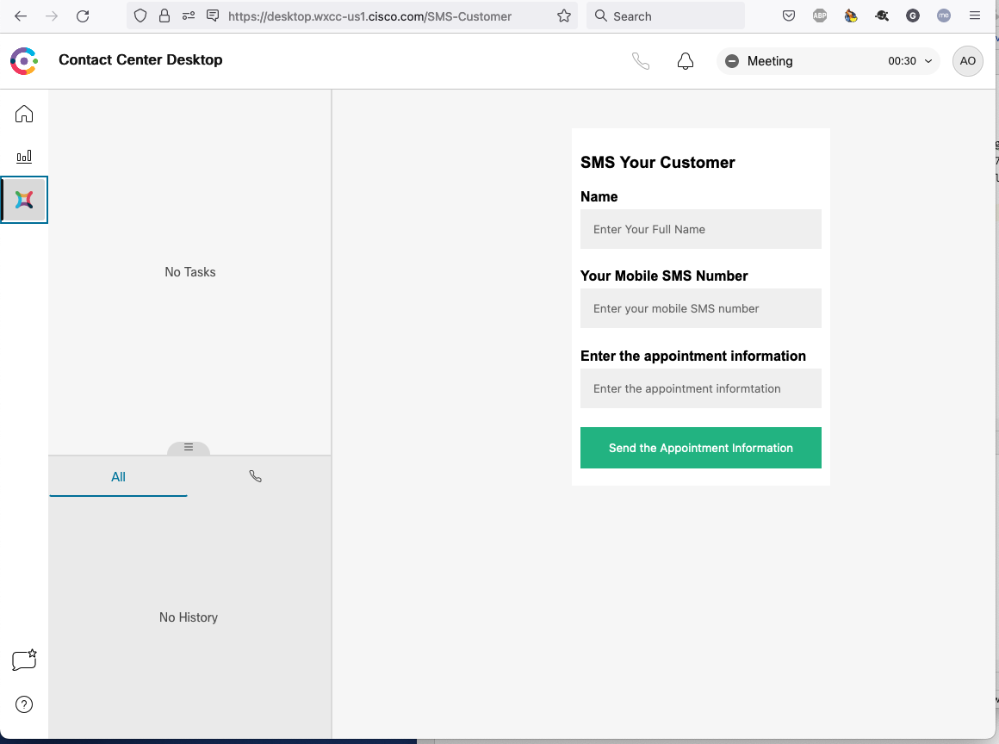
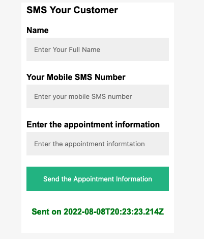

# GVE Devnet Webex Contact Center Send SMS Widget  

Sample Webex CC iFrame widget to send an SMS message using the Webex Connect (IMI) REST APIs  


## Contacts
* Gerardo Chaves (gchaves@cisco.com)

## Solution Components
* Webex Contact Center
* Webex Connect (IMI)

## Related Sandbox Environment

To be able to test sending SMS messages, you can use the Webex Connect Sandbox available at 
https://sandbox.imiconnect.io 


## Installation/Configuration

Clone this repository with `git clone [repository name]`  or you can just download the files with the "Download Zip" 
option within the green Code dropdown button and unzip them in a local directory.  

Set up a Python virtual environment. Make sure Python 3 is installed in your environment, and if not, 
you may download Python [here](https://www.python.org/downloads/).  

Once Python 3 is installed in your environment, you can activate the virtual environment with 
the instructions found [here](https://docs.python.org/3/tutorial/venv.html).  

Install the sample code requirements with `pip3 install -r requirements.txt`  

Now edit the .env file to fill out  the following configuration variables:  

**IMI_SERVICE_KEY**  
Copy the Webex Connect (IMI) Service key for your account or sandbox here.  

**SMS_ORIGIN**  
Specify the originating Webex Connect phone number for sending SMS here  

Create a custom Agent Desktop in Webex Contact Center that includes an iFrame based widget type "agentx-wc-iframe".  
Here is an example of a Widget Tab that contains such an iFrame widget that uses the URL http://127.0.0.1:5500 which 
points to the web service you get when running this sample code locally as per the instructions below and implements 
the page to send SMS that will be displayed in an iFrame in the agent desktop:

``` 

      {
              "nav": {
                "label": "SMS",
                "icon": "/app/images/wxm.bcd45cc3.svg",
                "iconType": "other",
                "navigateTo": "SMS-Customer",
                "align": "top"
              },
              "page": {
                "id": "SMS-Customer",
                "widgets": {
                  "comp1": {
                    "comp": "agentx-wc-iframe",
       
                      "attributes": {
                          "src": "http://127.0.0.1:5500"
                      }
                  }
                },
                "layout": {
                  "areas": [["comp1"]],
                  "size": {
                    "cols": [1],
                    "rows": [1]
                  }
                }
              },
              "visibility": "SMS-Customer"
      }

```

A full example of the custom Desktop JSON file is included in the [SMS_Agent_Desktop.json](SMS_Agent_Desktop.json) 
file included in this repository; it is basically the base Agent Desktop with the above specified Widget Tab added.  

More information on iFrame widgets can be found in the [Webex CC provisioning](https://www.cisco.com/c/en/us/td/docs/voice_ip_comm/cust_contact/contact_center/webexcc/SetupandAdministrationGuide_2/b_mp-release-2/b_cc-release-2_chapter_011.html?bookSearch=true) and 
the custom widgets sectino of the [Webex CC Desktop Developer Guide](https://developer.webex-cx.com/documentation/guides/desktop/#custom-widgets)


## Usage

Once you have your environment set up and have created the custom agent desktop .json file and have assigned it to an agent, 
start the Flask application:

    $ python server.py

Once the flask app is running, use a browser to go to the Webex CC Agent portal, typically at: https://desktop.wxcc-us1.cisco.com  

You can then click on the "SMS" tab on the left:  

  

Fill out the form and click on the "Send the Appointment Information" button.  

You should then see the form clear out and a 5 second confirmation message will appear on the form if 
the message was successfully sent, otherwise, an error code will show on the form:  




### LICENSE

Provided under Cisco Sample Code License, for details see [LICENSE](LICENSE.md)

### CODE_OF_CONDUCT

Our code of conduct is available [here](CODE_OF_CONDUCT.md)

### CONTRIBUTING

See our contributing guidelines [here](CONTRIBUTING.md)

#### DISCLAIMER:
<b>Please note:</b> This script is meant for demo purposes only. All tools/ scripts in this repo are released for use "AS IS" without any warranties of any kind, including, but not limited to their installation, use, or performance. Any use of these scripts and tools is at your own risk. There is no guarantee that they have been through thorough testing in a comparable environment and we are not responsible for any damage or data loss incurred with their use.
You are responsible for reviewing and testing any scripts you run thoroughly before use in any non-testing environment.